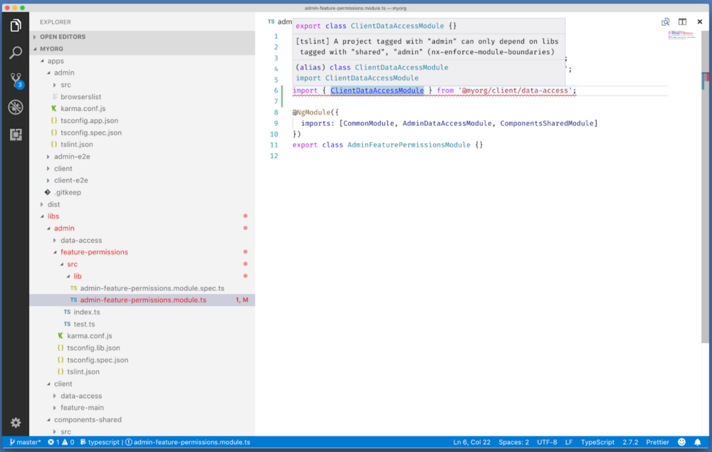

# Imposing Constraints on the Dependency Graph

If you partition your code into well-defined cohesive units, even a small organization will end up with a dozen apps and dozens or hundreds of libs. If all of them can depend on each other freely,
the chaos will ensue and the workspace will become unmanageable.

To help with that Nx uses code analyses to make sure projects can only depend on each other's well-defined public API. It also allows you to declaratively impose constraints on how projects can depend on each other.

## Tags

Nx comes with a generic mechanism for expressing constraints: tags.

First, use `nx.json` to annotate your projects with tags. In this example, we will use three tags: `scope:client`. `scope:admin`, `scope:shared`.

```json
{
  "npmScope": "myorg",
  "implicitDependencies": {
    "angular.json": "*",
    "package.json": "*",
    "tsconfig.json": "*",
    "tslint.json": "*",
    "nx.json": "*"
  },
  "projects": {
    "client": {
      "tags": ["scope:client"],
      "implicitDependencies": ["client-e2e"]
    },
    "client-e2e": {
      "tags": ["scope:client"],
      "implicitDependencies": []
    },
    "admin": {
      "tags": ["scope:admin"],
      "implicitDependencies": ["admin-e2e"]
    },
    "admin-e2e": {
      "tags": ["scope:admin"],
      "implicitDependencies": []
    },
    "client-feature-main": {
      "tags": ["scope:client"],
      "implicitDependencies": []
    },
    "admin-feature-permissions": {
      "tags": ["scope:admin"],
      "implicitDependencies": []
    },
    "components-shared": {
      "tags": ["scope:shared"],
      "implicitDependencies": []
    }
  }
}
```

Next open the top level `tslint.json` to add the constraints.

```json
{
  "nx-enforce-module-boundaries": [
    true,
    {
      "allow": [],
      "depConstraints": [
        {
          "sourceTag": "scope:shared",
          "onlyDependOnLibsWithTags": ["scope:shared"]
        },
        {
          "sourceTag": "scope:admin",
          "onlyDependOnLibsWithTags": ["scope:shared", "scope:admin"]
        },
        {
          "sourceTag": "scope:client",
          "onlyDependOnLibsWithTags": ["scope:shared", "scope:client"]
        }
      ]
    }
  ]
}
```

With these constrains in place, `scope:client` projects can only depend on other `scope:client` projects or on `scope:shared` projects. And `scope:admin` projects can only depend on other `scope:admin` projects or on `scope:shared` projects. Projects without any tags cannot depend on any other projects.

If you add the following, projects without any tags will be able to depend on any other project.

```json
{
  "sourceTag": "*",
  "onlyDependOnLibsWithTags": ["*"]
}
```

If you try to violate the constrains, you will get an err:



## Multiple Dimensions

The example above shows using a single dimension: `scope`. It's the most commonly used done. But there are other dimensions that you can find useful. You can define which projects contain components, NgRx code, and features, so you, for instance, can disallow projects containing dumb UI components depend on NgRx. You can define which projects are experimental and which are stable, so stable applications cannot depend on experimental projects etc. You can define which projects have server-side code and which have client-side code to make sure your node app doesn't bundle in Angular.
