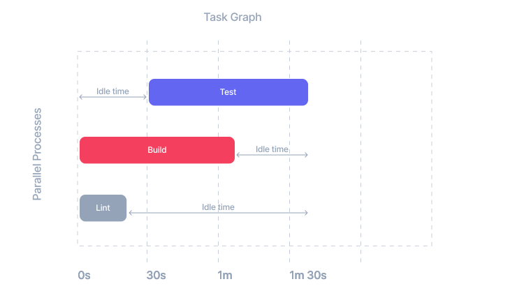

# Distribute Task Execution (DTE)

Nx speeds up your average CI time with [caching](/core-features/cache-task-results) and the [affected command](/concepts/affected). But neither of these features help with the worst case scenario. When something at the core of your repo has been modified and every task needs to be run in CI, the only way to improve the performance is by adding more agent jobs and efficiently parallelizing the tasks.

The most obvious way to parallelize tasks is to split tasks up by type: running all tests on one job, all builds on another and all lint tasks on a third. This strategy is called binning. This can be made difficult if some test tasks have build tasks as prerequisites, but assuming you figure out some way to handle that, a typical set up can look like the diagram below. Here the test tasks are delayed until all necessary build artifacts are ready, but the build and lint tasks can start right away.



The problem with the binning approach is you'll end up with some idle time on one or more jobs. Nx's distributed task execution reduces that idle time to the minimum possible by assigning each individual task to agent jobs based on the task's average run time. Nx also guarantees that tasks are executed in the correct order and uses distributed caching to make sure that build artifacts from previous tasks are present on every agent job that needs them.

When you set up Nx's distributed task execution, your task graph will look more like this:


And not only will CI finish faster, but the debugging experience is the same as if you ran all of your CI on a single job. That's because Nx uses distributed caching to recreate all of the logs and build artifacts on the main job.

## Set up

To distribute your task execution, you need to (1) connect to Nx Cloud and (2) enable DTE in your CI workflow. Each of these steps can be enabled with a single command:

```shell title="1. Connect to Nx Cloud"
nx connect-to-nx-cloud
```

```shell title="2. Enable DTE in CI"
nx generate @nrwl/workspace:ci-workflow --ci=github
```

The `--ci` flag can be `github`, `circleci` or `azure`. For more details on setting up DTE, read [this guide](https://nx.dev/nx-cloud/set-up/set-up-dte).

## CI Execution Flow

Distributed task execution can work on any CI provider. You are responsible for launching jobs in your CI system. Nx Cloud then coordinates the way those jobs work together. There are two different kinds of jobs that you'll need to create in your CI system.

1. One main job that controls what is going to be executed
2. Multiple agent jobs that actually execute the tasks

The main job execution flow looks like this:

```yml
# Coordinate the agents to run the tasks
- npx nx-cloud start-ci-run
# Run any commands you want here
- nx affected --target=lint & nx affected --target=test & nx affected --target=build
# Stop any run away agents
- npx nx-cloud stop-all-agents
```

The agent job execution flow is very simple:

```yml
# Wait for tasks to execute
- npx nx-cloud start-agent
```

## Illustrated Guide

For more details about how distributed task execution works, check out the [illustrated guide](/concepts/dte) by Nrwlian [Nicole Oliver](https://twitter.com/nixcodes).

[](/concepts/dte)

## See Also

- [Nx Cloud Documentation](/nx-cloud/intro/what-is-nx-cloud)
- [Nx Cloud Main Site](https://nx.app)
